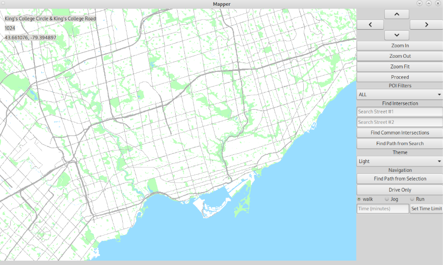
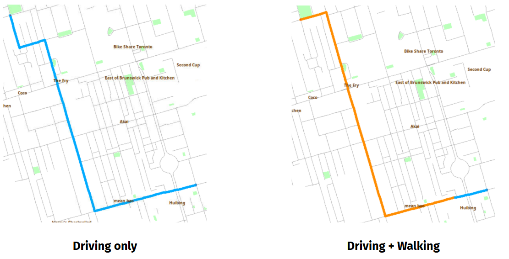
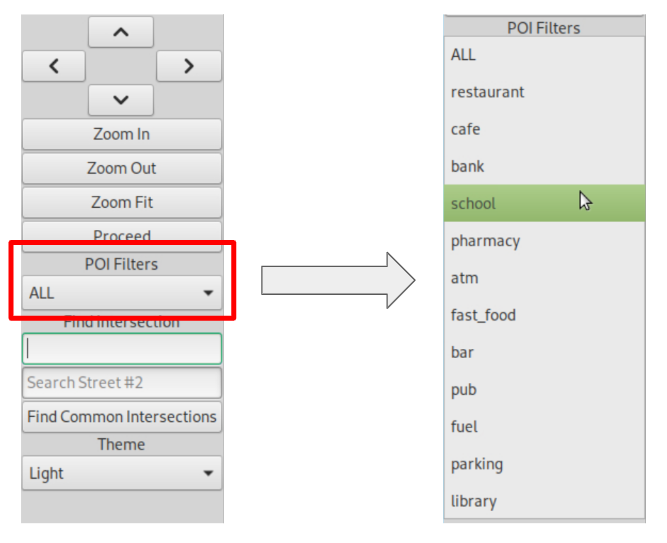
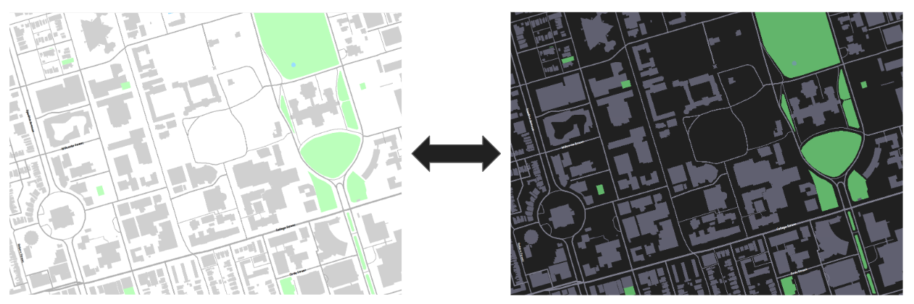
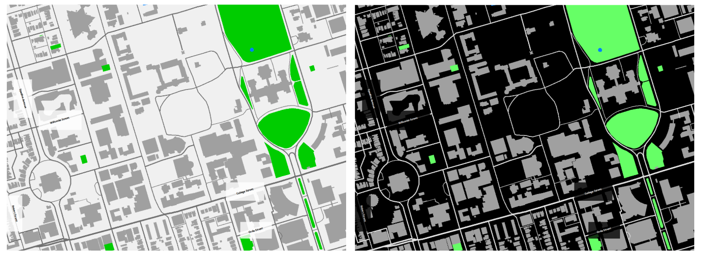

# CitySense GIS

CitySense is an interactive geographic information system developed in **C++** as a team project for **ECE297 – Software Communication and Design** at the University of Toronto.

The application provides interactive map visualization, street and intersection search, route planning, turn-by-turn navigation, points-of-interest filtering, and configurable map themes. The project focused on building a responsive and readable GIS capable of handling large map datasets while maintaining a clean user interface.

> **Note:** This repository is a portfolio snapshot of the project. Course-provided libraries, EZGL framework code, testing infrastructure, and automated tests have been omitted. The repository contains team-developed source code and project assets.

## Map Overview

CitySense renders streets, intersections, buildings, geographic features, and points of interest while adapting the amount of displayed information based on the current zoom level.

The interface keeps the map as the primary focus while providing navigation and configuration controls through a compact side panel.



## Features

### Route Planning & Navigation

CitySense uses **A\* graph search** to calculate efficient routes between locations.

The navigation system provides:

- Estimated travel time
- Driving and walking route support
- Highlighted paths on the map
- Start and destination information
- Human-readable turn-by-turn directions



### Real-Time Street Search

Street search dynamically suggests matching street names while the user types, reducing typing effort and making intersection searches faster.

When two streets are selected, CitySense can determine their common intersections.

**Demo:**  
[Watch the Real-Time Search Demo](https://drive.google.com/file/d/1uY1SZMqAFkVU0aNMKF-xzl1o_tw8B3Qk/view?resourcekey)

### Automatic Intersection Focus

After a valid intersection is selected, the map automatically:

- Centers the selected intersection
- Pans to the relevant location
- Adjusts the zoom level for easier viewing
- Displays information about the selected intersection
- Handles invalid search input with user feedback

**Demo:**  
[Watch the Intersection Focus Demo](https://drive.google.com/file/d/1fRwZWRA-U77oyf63vFoZsfJknHiaKiaH/view?resourcekey)

### Points of Interest Filtering

Users can filter displayed points of interest by category, including locations such as restaurants, cafés, schools, banks, pharmacies, and other amenities.

This reduces visual clutter and allows users to quickly locate relevant destinations.



### Adaptive Map Rendering

To keep the map readable and responsive, CitySense changes the level of detail based on zoom level.

Features include:

- Road-width prioritization based on street importance
- Displaying major roads first when zoomed out
- Showing buildings and detailed features only at appropriate zoom levels
- Prioritizing important street labels
- Bounding-box collision detection to prevent overlapping labels
- Limiting the number of labels rendered at once

### Configurable Map Themes

CitySense supports multiple visual themes to improve readability and allow users to customize the interface.

#### Light and Dark Themes



#### High-Contrast Themes



## Technical Highlights

### A* Pathfinding

The routing system uses an implementation of the **A\*** search algorithm to efficiently explore the street network and generate routes between intersections.

Route information is converted into readable navigation instructions and visualized directly on the map.

### Level-of-Detail Rendering

Rendering complexity changes dynamically based on the visible map area and zoom level. This reduces unnecessary drawing operations while preserving important geographic information.

### Label Collision Detection

Street and POI labels use bounding-box collision detection to determine whether sufficient space exists before rendering a new label.

This prevents dense regions from becoming unreadable when many streets and points of interest are visible simultaneously.

### Interactive UI

The application includes:

- Street search
- Intersection lookup
- Automatic map focusing
- POI filtering
- Zoom controls
- Route visualization
- Navigation instructions
- Interactive tooltips
- Theme selection

## Technologies

- **C++**
- **A\* Graph Search**
- **Data Structures & Algorithms**
- **GIS / Map Rendering**
- **KD-Trees**
- **Graph Traversal**
- **Collision Detection**
- **Git / Version Control**

## Project Structure

```text
CitySense-GIS/
│
├── libstreetmap/
│   ├── resources/
│   └── src/
│       ├── globalData.cpp
│       ├── globalData.h
│       ├── KDTree.cpp
│       ├── KDTree.h
│       ├── m1.cpp
│       ├── m1Helpers.cpp
│       ├── m1Helpers.h
│       ├── m2.cpp
│       ├── m2Helpers.cpp
│       ├── m2Helpers.h
│       ├── m3.cpp
│       ├── m3Helpers.cpp
│       ├── m3Helpers.h
│       ├── m4.cpp
│       ├── m4Helpers.cpp
│       └── m4Helpers.h
│
├── screenshots/
│   ├── map-overview.png
│   ├── route-navigation.png
│   ├── poi-filtering.png
│   ├── light-dark-themes.png
│   └── high-contrast-themes.png
│
├── .gitignore
└── README.md
```

## Team

Developed by **Team 047** for ECE297 at the University of Toronto:

- Jinwen (Maggie) Ma
- William Forbes
- Arshiya Mostafavisabet

## Course

**ECE297 – Software Communication and Design**  
University of Toronto  
January 2026 – April 2026

## Repository Notice

The original project was developed using course-provided mapping libraries, the EZGL graphics framework, and course testing infrastructure.

Those components are intentionally **not included in this repository**. As a result, this repository is intended as a portfolio representation of the team's implementation rather than a standalone build of the complete ECE297 development environment.
